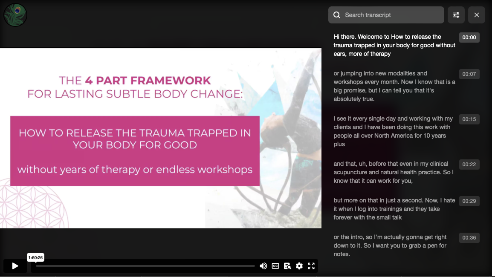

<h1>Selenium-Transcription</h1> 

<h3>Test Subjects</h3>
https://empathtrauma.com 
https://easyyesleads.com 
https://www.youtube.com 
https://xhoni-mimillari.mykajabi.com/linkedin 

<h3>Programming Language</h3>
Java  

<h3>Libraries/Tools Used</h3> 
* Selenium - Web automation 
* Selenium devtools - capturing network requests 
* CompletableFutures to handle async queries 
* assemblyAI - transcribing audio files 
* TestNG - Test execution 
* REST Assured - Validation of REST web services 
* log4j - Capturing logs 
* Extent Reports - reporting 
* Gradle - Build and package management 
* FFmpeg - For extracting audio data from streaming video files 

<h3>Overview</h3>
This project demonstrates test automation with iframes containing lazy-loaded elements. The aim is to locate audio data that can be used to create transcripts. Streaming video files (m3u8) are transcribed by using FFmpeg as a subprocess to convert them into an audio file first, then transcribing the converted file. Selenium devtools is used to capture network requests, associated with click events in order to get audio file links from the request.  The links are then passed to the assemblyAI API to produce transcriptions of the audio files. The transcription is then written to a .txt file.  If the target provides text or transcription data already, then that data is simply located and written to a .txt file. All files produced by the testcases are for testing purposes only. 
<h3>Getting Started</h3>
Follow these steps to get started 
1.) Clone this repository to your local machine.  
2.) cd selenium-transcription  
3.) Rename "sample.env" to ".env" in src/test/resources, you will also need an assemblyAI API key 
4.) Fill in all the appropriate property values in the .env file 
5.) Add the url for any youtube video as a TestNG parameter in the TextNG.xml file 
6.) Be sure you have FFmpeg installed  
7.) gradle clean test 
